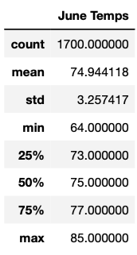
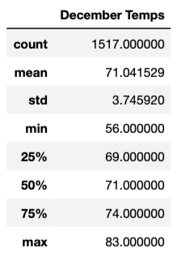
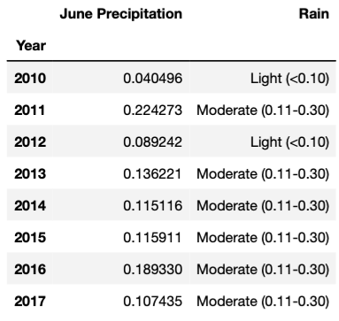
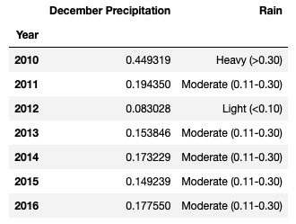
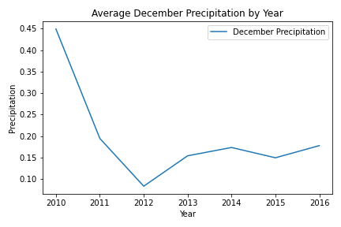

# Surf's Up Analysis

## Overview

### Purpose

The purpose of this study is to provide W. Avy, an investor who’s passionate about surfing, a weather analysis for financial backing on the Surf n’ Shake venture. Surf n’ Shake is proposed as a shop serving surfboards and ice cream to locals and tourists in the beautiful island Oahu, Hawaii. 

Using Python and SQLAlchemy, a summary statistics for temperatures in June and December was generated by performing an exploratory analysis on the weather data. This analysis can be used to seal the deal with W. Avy and put him at ease that Surf n’ Shake is a business worth investing. Aloha Hawaii! 


## Results

### Dataset and Files

The analysis is based on the following SQLite database and dataset: 

* Weather Data: [hawaii](hawaii.sqlite)

The analysis is available here: [SurfsUp_Challenge](SurfsUp_Challenge.ipynb)

The additional queries are available here: [Additional_queries](Additional_queries.ipynb)

### Software and Application

The software and web-based application used for this analysis are:

* Python Version 3.7.11 (using PythonData environment and Pandas Library)
* Jupyter Notebook Version 6.4.6
* SQLAlchemy Version 1.4.31
* SQLite Version 3.37

### Outcomes 

The data summary below provides solid statistical analysis—such as the mean, standard deviation, minimum, maximum, and percentiles for temperatures in June and December, respectively. The count is the number of times temperature was observed.

<p float="left">
  
   
</p>

Here are 3 points worth noting from the above temperature summary statistics:

* An initial data exploration on weather dataset was done to filter the months of June and December from all the years of data available in the SQLite database. As data was retrieved, it was found that the total number of times temperature was observed for June was 1,700 and for December was 1,517. Note the last row of data available in the SQLite database is August 23, 2017, hence the count difference of 183 in the summary statistics between June and December.

To obtain specific temperature data, the **extract function** along with the **query method** was used for the month of June as follows:

```
June = []
June = session.query(Measurement.tobs).filter(extract('month', Measurement.date)==6).all()
```

And for the month of December as follows:

```
December = []
December = session.query(Measurement.tobs).filter(extract('month', Measurement.date)==12).all()
```

* Moreover, the mean or average temperature for June is 75 degrees Fahrenheit and 71 degrees Fahrenheit for December; rounded up to the nearest integer.  This displays temperatures during the Summer and Winter seasons are not far off from each other and are consistent every year.

* Lastly, it is observed that 75% of the time the temperature for June and December sets at 77 degrees Fahrenheit and 74 degrees Fahrenheit, respectively. This allows to have confidence that Surf n’ Shake can be open for business throughout the year.
      
## Summary

To offer more certainty on the provided weather data, additional queries were run to retrieve the average precipitation for June and December along with rain classifications grouped by year. 

>“Rain is classified as light, meaning rain falling at a rate between a trace and 0.10 inch per hour; moderate, 0.11 to 0.30 inch per hour; heavy, more than 0.30 inch per hour.”

>Skilling, Tom. “Ask Tom: Are there definitions for downpour, drizzle or light, steady, heavy rain?” The Chicago Tribune. 28 September 2018,      www.chicagotribune.com/weather/ct-wea-asktom-0929-20180928-column.html/. Accessed 13 February 2022.

<p float="left">
  
   
</p>

As shown above, the average precipitation for June and December were both mainly classified as moderate rain despite the year 2010 where it was classified as heavy rain for the month of December.

Furthermore, a line graph was created to visualize the same data in chronological order. Along the x-axis are the years from our dataset, and the y-axis is the average amount of precipitation. One trend we can observe based on this plot is that some years have higher amounts of precipitation than others. In 2011, 0.22 inches of rain fall per hour was recorded as the highest year for the month of June. By the same token, 0.44 inches of rain fall per hour was recorded as the highest year for the month of December in 2010.

<p float="left">
  
   
</p>


To generate this graph the following code was used on its respective month data:

```
import matplotlib.pyplot as plt

rain_summary_df.plot()
plt.title("Average June Precipitation by Year")
plt.xlabel('Year')
plt.ylabel('Precipitation')
plt.tight_layout()
plt.savefig("Images/June_precipitation_graphsummary.png")
```


In conclusion, an exploratory analysis on weather data was completed to generate a summary statistics for temperatures in June and December. Using Python and SQLAlchemy, additional queries were run to retrieve precipitation data on both June and December months. The precipitation data was then represented in a line chart to further instill confidence in W. Avy to invest in Surf n’ Shake with an eye toward future expansion. Given all the data reflected above, weather should not be a major concern with respect to investing in Surf n’ Shake. Surf's up!


